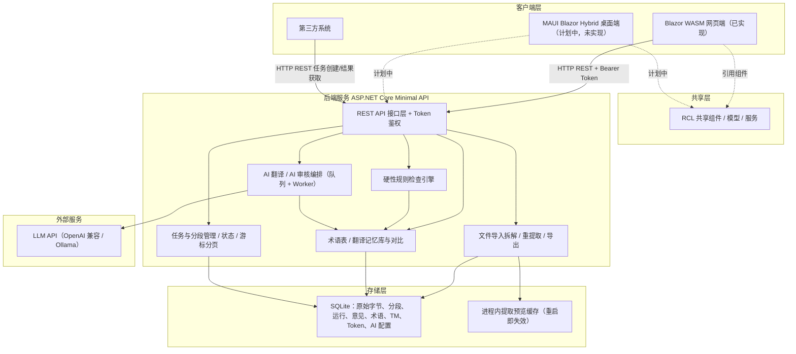

# AGENTS.md — MyTranslator

本文件为 **MyTranslator** 项目的架构与开发约定说明，供协作者（人类或 AI Agent）在参与开发时快速了解项目结构、技术选型、实际实现与硬性规则。用户视角的功能介绍见 [README.md](README.md)。

## 1. 项目简介

MyTranslator 是一个自用的 CAT（计算机辅助翻译）工具，参考 OmegaT 的核心工作流，但加入全自动 AI 翻译、AI 审核意见与硬性规则检查规则。目标是个人日常使用，同时保留标准 API 供其他系统对接。

界面、文档与代码注释使用中文；接口字段与错误码使用英文小写。

## 2. 技术选型

| 层面 | 选择 | 现状 |
|---|---|---|
| 后端 | ASP.NET Core Minimal API，目标框架 `net10.0` | 已实现 |
| B 端前端 | Blazor WebAssembly（`net10.0`） | 已实现 |
| C 端客户端 | .NET MAUI Blazor Hybrid | **尚未实现**（ROADMAP「六、客户端开发」，计划中） |
| 共享 UI 组件 | Razor Class Library（`MyTranslator.Shared`） | 已实现，按双端共用设计 |
| 数据库 | SQLite（EF Core 10.0.9，零运维） | 已实现 |
| AI 翻译/审核 | `Microsoft.Extensions.AI` 10.8.3 抽象 + OpenAI 兼容接口（`Microsoft.Extensions.AI.OpenAI`）/ OllamaSharp 5.4.30 | 已实现，可插拔不绑定厂商 |
| UI 组件库 | MudBlazor 9.8.0（通用组件） | 全仓版本必须一致 |
| 测试 | xUnit 2.9.3 + Microsoft.NET.Test.Sdk | 已实现 |
| 依赖管理 | NuGet（有意避开 npm 生态，降低供应链投毒风险） | 强制 |

`net10.0` 是唯一目标框架；开发环境已验证 .NET SDK 10.0.301。

## 3. 架构图



不存在独立的「文件存储」：任务的原始文件字节（`TranslationTask.SourceBytes`）、重建模板与全部分段、运行、意见、术语、TM 条目、Token、AI 提供商配置都存 SQLite；只有提取预览是进程内单例缓存。

## 4. 项目结构与入口

```
MyTranslator.slnx                     解决方案（新版 .slnx 格式）
src/MyTranslator.Api/                 后端
  Program.cs                          组合根：DI、鉴权、CORS、端点映射（全部路由在此登记）
  appsettings.json                    连接串、并发上限、日志级别
  Data/                               AppDbContext、实体、Migrations、DatabaseInitializer
  Authentication/                     TokenAuthenticationHandler、TokenValue、默认方案常量
  Tokens/                             Tokens 端点：生成 / 列表 / 撤销
  AiConfiguration/                    提供商与模型 CRUD、默认对、密钥掩码
  FileTasks/                          导入拆解、URL 导入、提取预览、导出还原、分段读取
  TaskLists/                          GET /api/tasks 游标分页与状态筛选
  TaskOperations/                     译文保存、批量确认、TaskOperationLock 单任务互斥
  Translation/                        翻译运行：队列、Worker、Processor、Service、IChatClient 工厂
  Review/                             审核运行：同上结构 + ReviewOptions
  Rules/                              ITranslationRule、RuleEngine、内置规则、RuleCheckService
  Terms/                              术语 CRUD、术语对齐匹配与检查
  TranslationMemory/                  TM 条目、相似度匹配、对比与差异告警
  Pagination/  Text/                  游标编解码、占位符引用解析、文本相似度
  Dockerfile                          .NET 10 SDK 多阶段构建（构建上下文 = 仓库根目录）
src/MyTranslator.Shared/              共享 RCL（网页端与桌面端共用）
  Components/                         领域组件：编辑器、分段列表、差异视图、进度看板、徽标等
  Services/                           ApiClient、错误码文案映射、各资源 Service、主题、本地存储桥
  Models/  Resources/                 请求/响应模型与 resx 文案（含 LogicalName 映射）
  wwwroot/                            mt.css 主题、storage/download/dialog/editor 等 JS 桥
src/MyTranslator.Web/                 网页端
  Program.cs                          前端 DI 与 HttpClient 基址
  Pages/                              路由：/ /login /tasks/import /tasks/{id} /terms /tokens /settings
  Layout/                             主布局、导航、主题切换
  nginx.conf                          生产托管：SPA 回退、MIME、gzip 静态、/api 反向代理
tests/MyTranslator.Api.Tests/         后端集成测试（ApiFactory）
tests/MyTranslator.Shared.Tests/      共享层单元测试（JS 互操作替身）
docs/back/                            前后端接口约定（契约权威来源）
docs/front/                           前端设计/组件/交互规范与审查标准
docs/adr/                             架构决策记录
docs/agents/                          issue tracker、triage 标签、领域文档约定
CONTEXT.md                            领域术语表与用语红线
.agents/skills/                       项目级技能：frontend-coding、frontend-review、roadmap-to-docs
```

## 5. 模块职责说明

- **文件导入拆解/导出（`FileTasks`）**：把支持格式解析为可翻译分段，处理占位符/标记提取与回填，导出时按重建模板还原。支持 txt、markdown、html、epub、URL；仅覆盖自用格式，不追求大而全。原文标记提取模型见 ADR-0002。
- **术语表 / 翻译记忆库（`Terms`、`TranslationMemory`）**：维护术语与 TM，提供模糊匹配、术语对齐检查与差异对比结论；匹配分数、差异分数与告警结论一律由后端计算，前端只呈现。
- **AI 翻译/审核编排（`Translation`、`Review`、`AiConfiguration`）**：异步运行 = 队列 + 后台 Worker + Processor + Service，绑定创建时的提取修订，状态机为 `queued/processing/completed/partial_failed/failed`，支持中断恢复、分段级失败记录与部分失败。上下文注入术语命中（TM 预留）。
- **硬性规则检查引擎（`Rules`）**：不依赖 AI 的确定性校验。内置占位符完整性与漏翻检测；新规则实现 `ITranslationRule` 并在 `Program.cs` 注册即可，不改核心流程。
- **任务与状态管理（`TaskLists`、`TaskOperations`、`Data`）**：任务生命周期（created/processing/completed/failed）、进度统计（受保护块不计入分段）、译文保存与确认、游标分页。`TaskOperationLock` 保证同一任务上的改写操作串行互斥。

## 6. 接口设计原则

- 所有前端（Web/Desktop）与外部系统统一通过同一套 REST API 交互，不存在「内部专用接口」和「外部接口」的区分，降低维护成本。
- API 遵循资源化设计，例如：`/api/providers`、`/api/terms`、`/api/tm/entries`、`/api/tasks`、`/api/tasks/{id}/translation-runs`、`/api/tasks/{id}/review-runs`、`/api/tasks/{id}/result`。
- **鉴权已实现**：全部 `/api` 路由默认要求 `Authorization: Bearer sk-{32 位十六进制}`（`FallbackPolicy = RequireAuthenticatedUser`，代码中没有任何 `AllowAnonymous`，包含 `/api/health`）。Development 环境额外接受 `sk-dev-{32 位十六进制}`。Token 以哈希存库，响应只回显前缀。
- 错误响应为 ProblemDetails 形状，附稳定 `code` 字段供前端映射文案；调用方不得依赖 `title`/`detail` 文本。
- 列表接口统一游标分页（`OpaqueCursorCodec`）。
- 同一任务同一时刻只允许一个改写型运行；活动翻译/审核期间保存译文、导出、重新提取与另一运行返回 `409 task_busy`。
- 字段、状态与错误码的权威定义在 `docs/back/`：改接口先改契约文档，再改代码。

## 7. 开发约定

- 所有开发前，**必须**确认是前端还是后端任务，**禁止**同时开发前端与后端。
- 所有前端与后端交互的约定，在 `docs/back` 下以 md 格式保存；前端界面规范在 `docs/front` 下以 md 格式保存，涉及前端界面改动时**必须**遵守。
- 前端严格遵守 `docs/front` 的「必须（MUST）」级条款；与用户需求冲突时按 `.agents/skills/frontend-coding` 要求逐项确认后再改规范文档，不得静默绕过。
- 前端不得自行解释错误码：用户可见文案一律由 `ApiErrorMessageProvider` 按稳定 `code` 映射，用户可见字符串集中放 resx，禁止硬编码。
- 避免引入 npm/JS 生态依赖；前端交互统一通过 Blazor 组件与 C# 完成（必要的最小 JS 只作为 `wwwroot/js` 下的互操作桥）。
- 新增第三方 NuGet 依赖前需评估维护活跃度与来源可信度；MudBlazor 版本全仓一致、锁版本，升级走独立提交并双端验证。
- 硬性规则检查引擎的规则独立于业务代码（`ITranslationRule`），新增规则不改动核心流程。
- 共享 UI 组件统一放入 Razor Class Library，避免 Web 端与桌面端重复实现。
- 输出与代码命名使用 `CONTEXT.md` 的词汇：说「确认」指分段确认状态，任务层面说「完成/失败」；「违规」指规则引擎检出，「错误」仅指系统/接口故障；「审核意见」不称「评分/报告」。

## 8. 构建、运行与测试

```powershell
dotnet build MyTranslator.slnx            # 构建（0 警告 0 错误）
dotnet test  MyTranslator.slnx            # 全量测试（当前 359 个：Api 163、Shared 196）
dotnet run --project src/MyTranslator.Api # 后端 http://localhost:5199，Swagger 在 /swagger
dotnet run --project src/MyTranslator.Web # 前端 http://localhost:5000
```

- 本地跨端口开发需自建 `src/MyTranslator.Web/wwwroot/appsettings.Development.json`（被 `.gitignore` 忽略），设置 `Api:BaseUrl = http://localhost:5199` 与 `Auth:DevToken`；否则前端按同源请求。VS Code 可用 `.vscode/launch.json` 的「MyTranslator: Full Stack」复合启动。
- 后端测试经 `WebApplicationFactory<Program>`（`ApiFactory`）运行，使用内存 SQLite（`Mode=Memory;Cache=Shared`）与替身 `IChatClient`/`HttpMessageHandler`；前端测试使用 `FakeJSRuntime`、`StubHttpMessageHandler` 等替身。两者都不访问网络、不启动浏览器，可离线全量运行。
- 验证顺序：改后端跑 `MyTranslator.Api.Tests`，改共享层跑 `MyTranslator.Shared.Tests`；涉及界面交互时以真实浏览器验证为准（测试不能替代浏览器验证）。

## 9. 配置与密钥流

- 初始 Token 由环境变量 `INITIAL_TOKEN` 注入，`DatabaseInitializer` 在启动时迁移数据库、启用 WAL 并写入首条 Token（存哈希）。Development 未配置时回退固定开发 Token `sk-dev-00000000000000000000000000000000` 并记警告；非 Development 缺失或格式错误直接启动失败。相同 Token 不重复插入。
- AI 提供商的 BaseUrl、ApiKey、模型与默认对不写入配置文件与环境变量，经 `/api/providers` 或设置页写入 SQLite；密钥响应一律掩码（`apiKeyMasked` 为只读字段，请求携带即被拒绝），不写日志（ADR-0003）。
- 前端只在 localStorage 保存访问 Token（`TokenStore` / `storage.js`），不保存其他秘密；语言对等非秘密偏好也存 localStorage（按任务持久化）。
- 生产 CORS 白名单为 `Cors:AllowedOrigins`（默认空）；生产部署走 nginx 同源反向代理，浏览器 `Api:BaseUrl` 保持为空。

## 10. 关键约束与已知陷阱

- **数据库迁移是手写的时间戳文件**（`Data/Migrations/*`，如 `20260831000000_AddTranslationMemoryEntries.cs`）。新增实体或字段时同时更新迁移与 `AppDbContextModelSnapshot`，并保证排序键与既有契约一致。
- **提取预览存在进程内单例缓存**（`ExtractionPreviewStore`，带过期时间）：重启即失效，多实例部署不共享；不要把它当作持久化状态。
- **导出依赖持久化的原始字节与重建模板**（`TranslationTask.SourceBytes` + `ReconstructionTemplate`）：任何破坏原始字节或标记表的改动都会让已有任务无法还原导出。
- **单任务互斥走 `TaskOperationLock`**：新增任何改写型端点（保存、确认、导出、重提取、创建运行）都必须纳入同一锁语义，否则会破坏 `409 task_busy` 契约。
- **占位符引用（ADR-0002）不可改写**：`<xN>`/`</xN>`/`<xN/>` 的增删改、嵌套与顺序问题由后端返回 `422`；前端只呈现、不修复。
- **前端异步竞态需代数守卫**：诊断/对比/运行轮询在任务切换、语言对变化、版本变化时必须取消旧请求并丢弃晚到响应；新增轮询同样要防护，否则旧结果会覆盖新状态。
- **共享 RCL 关闭了静态资产指纹化**（`StaticWebAssetFingerprintingEnabled=false`），资产以固定名引用；新增库内 CSS/JS 时保持固定名引用，否则发布态会 404。
- **前端 Release 开启裁剪**（`PublishTrimmed`，仅 publish 生效，`dotnet run` 不受影响）；前端发布依赖 Release 配置，不要为省事改回未裁剪发布。
- **resx 的 `LogicalName` 必须与类型全名一致**（`MyTranslator.Shared.Components.X.resources` 等），新增组件文案时同步在 csproj 登记，否则本地化静默失效。
- **文案与 API 契约冲突时的处理顺序**：先改 `docs/back` 契约文档，再改后端，最后改前端映射；禁止单侧绕过。

## Agent skills

### Issue tracker

Issues live as local markdown files under `.scratch/<feature>/`. See `docs/agents/issue-tracker.md`.

### Triage labels

Five canonical roles with default label strings: `needs-triage`, `needs-info`, `ready-for-agent`, `ready-for-human`, `wontfix`. See `docs/agents/triage-labels.md`.

### Domain docs

Single-context: one `CONTEXT.md` + `docs/adr/` at the repo root. See `docs/agents/domain.md`.

### 项目级技能（`.agents/skills/`）

- `frontend-coding` — 前端设计与编码规范强制流程（改前端代码前必须先读 `docs/front`）。
- `frontend-review` — 前端交付后的正式审查（按 `docs/front/审查标准.md`）。
- `roadmap-to-docs` — 按 ROADMAP 条目在 `docs/back` 生成/更新前后端接口约定。
