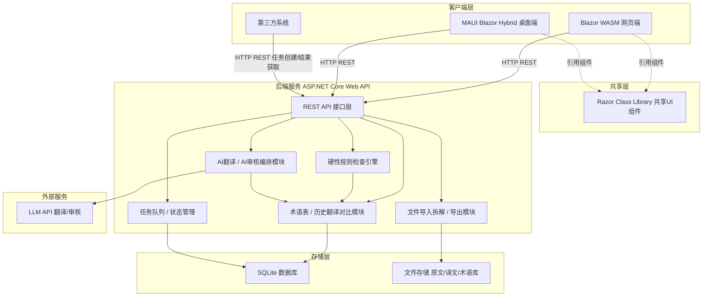

# AGENTS.md — MyTranslator

本文件为 **MyTranslator** 项目的架构与开发约定说明，供协作者（人类或AI Agent）在参与开发时快速了解项目结构、技术选型与规则。

## 1. 项目简介

MyTranslator 是一个自用的 CAT（计算机辅助翻译）工具，参考 OmegaT 的核心工作流，但加入全自动 AI 翻译、AI 审核意见与硬性代码检查规则。目标是个人日常使用，同时保留标准 API 供其他系统对接。

## 2. 技术选型

| 层面 | 选择 |
|---|---|
| 后端 | ASP.NET Core Web API (.NET) |
| B端前端 | Blazor WebAssembly |
| C端客户端 | .NET MAUI Blazor Hybrid |
| 共享UI组件 | Razor Class Library |
| 数据库 | SQLite（个人使用，零运维） |
| AI翻译/审核 | 通过 HTTP 调用外部 LLM API（可插拔，不绑定具体厂商）|
| 依赖管理 | NuGet（有意避开 npm 生态，降低供应链投毒风险）|

## 3. 架构图

## 4. 模块职责说明

- **文件导入拆解/导出模块**：负责将支持的文件格式解析为可翻译分段，处理占位符/标记的提取与回填，翻译完成后重新组装导出。仅支持自用的少数格式，不追求大而全。
- **术语表/历史翻译对比模块**：维护术语库与翻译记忆库（TM），提供模糊匹配、术语对齐检查能力，供AI翻译模块和规则引擎调用。
- **AI翻译/审核编排模块**：调用外部LLM API进行全自动翻译，并发起第二轮审核请求，产出AI审核意见。上下文中会注入TM匹配结果与相关术语。
- **硬性规则检查引擎**：不依赖AI的确定性规则校验，包括特殊标记保留检查、漏翻检测、TM差异过大预警、术语表对齐检查等。规则应可配置、可扩展。
- **任务队列/状态管理**：管理翻译任务的生命周期（创建、处理中、完成、失败），供内部前端和外部第三方系统通过API查询。

## 5. 接口设计原则

- 所有前端（Web/Desktop）与外部系统统一通过同一套 REST API 交互，不存在"内部专用接口"和"外部接口"的区分，降低维护成本。
- API 遵循资源化设计，例如：`/api/terms`、`/api/tm/compare`、`/api/tasks`、`/api/tasks/{id}/result`。
- 鉴权预留 API Key 或 JWT 方式，便于第三方系统对接。

## 6. 开发约定

- 避免引入 npm/JS 生态依赖；前端交互统一通过 Blazor 组件与 C# 完成。
- 新增第三方 NuGet 依赖前需评估维护活跃度与来源可信度。
- 硬性规则检查引擎的规则应独立于业务代码，便于后续新增规则而不改动核心流程。
- 共享 UI 组件统一放入 Razor Class Library，避免 Web 端与桌面端出现重复实现。
- 所有开发前，**必须**确认是前端还是后端任务，**禁止**同时开发前端与后端
- 所有前端与后端交互的约定，在 `docs/back` 下以md格式保存
- 前端界面规范，在 `docs/front` 下以md格式保存，涉及前端界面改动时**必须**遵守

## Agent skills

### Issue tracker

Issues live as local markdown files under `.scratch/<feature>/`. See `docs/agents/issue-tracker.md`.

### Triage labels

Five canonical roles with default label strings: `needs-triage`, `needs-info`, `ready-for-agent`, `ready-for-human`, `wontfix`. See `docs/agents/triage-labels.md`.

### Domain docs

Single-context: one `CONTEXT.md` + `docs/adr/` at the repo root. See `docs/agents/domain.md`.
